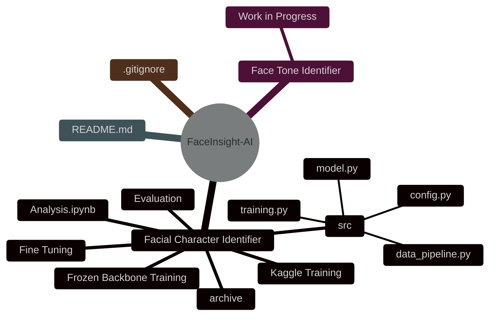
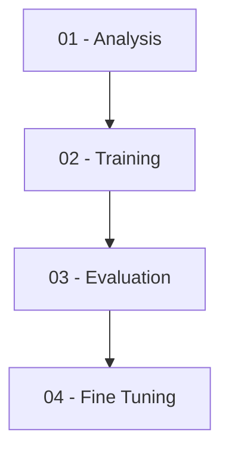
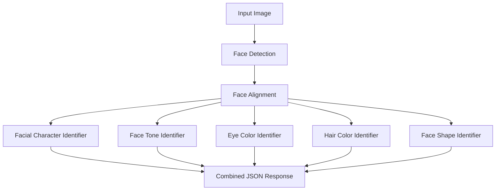

# FaceInsight-AI

FaceInsight-AI is a modular computer vision project focused on facial analysis using deep learning. Rather than training one large model to predict every facial characteristic, the project uses multiple specialized models, each designed for a specific task. This modular approach improves performance, simplifies maintenance, and allows individual models to be retrained or upgraded independently.

---

## Project Structure

---

## Models

| Model | Dataset | Purpose | Status |
|--------|---------|---------|--------|
| Facial Character Identifier | CelebA | Multi-label facial attribute classification | In Progress |
| Face Tone Identifier | Fitzpatrick17k / Skin Tone Dataset | Skin tone classification | In Development |
| Eye Color Identifier | TBD | Eye color detection | Planned |
| Hair Color Identifier | TBD | Hair color classification | Planned |
| Face Shape Identifier | MediaPipe / Landmark Dataset | Face shape classification | Planned |
| Facial Landmark Detection | Landmark Dataset | Landmark localization | Planned |
| Face Embeddings | ArcFace / FaceNet | Face representation | Planned |

---

## Facial Character Identifier

The first module focuses on predicting multiple facial attributes from a single aligned face image using transfer learning.

### Dataset

- CelebA
- 200K+ celebrity face images
- 40 annotated facial attributes

### Model

- EfficientNet-B0
- Transfer Learning
- Frozen Backbone Training
- Fine Tuning
- Multi-label Classification

### Predicted Attributes

- Gender
- Age Group
- Beard
- Mustache
- Smiling
- Eyeglasses
- Bangs
- Heavy Makeup
- Hair Features
- Remaining CelebA attributes

Example output:

```json
{
    "male": true,
    "young": true,
    "smiling": true,
    "eyeglasses": false,
    "beard": true
}
```

---

## Face Tone Identifier

The second module is dedicated to skin tone classification. It is being developed independently from the facial attribute model to improve accuracy and simplify future updates.

### Planned Dataset

- Fitzpatrick17k
- Skin Tone Dataset

### Target Classes

- Fair
- Light
- Medium
- Olive
- Brown
- Dark

---

## Features

- Modular deep learning architecture
- Independent models for each facial analysis task
- Transfer learning with pretrained backbones
- Kaggle and local training support
- Structured project layout for reproducible experiments
- Separate evaluation and fine-tuning workflows
- Easily extendable with new models and datasets

---

## Getting Started

Clone the repository:

```bash
git clone https://github.com/Harman8815/FaceInsight-AI.git
cd FaceInsight-AI
```

Place the required datasets inside the corresponding model's `archive/` directory and execute the notebooks in numerical order.


---

## Planned Inference Pipeline


---

## Design Goals

- Train specialized models instead of one large multi-task network.
- Keep each model independent for easier maintenance and retraining.
- Build a scalable repository where new facial analysis modules can be added without affecting existing models.
- Provide a production-ready pipeline that combines outputs from all models into a single API response.